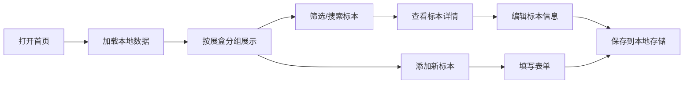

## 1. 产品概述

面向微型昆虫标本工作室的单机版标本管理系统，帮助用户系统化记录和管理昆虫标本信息，替代传统纸质记录，提升管理效率。
- 主要用途：记录标本基础信息、追踪标本状态、按展盒位置管理藏品、筛选未拍照标本
- 目标用户：昆虫标本收藏者、小型工作室、自然爱好者
- 产品价值：轻量化、无需部署、数据本地存储、开箱即用

## 2. 核心功能

### 2.1 用户角色

单机版本，无需登录，单一用户角色拥有全部权限。

### 2.2 功能模块

1. **首页**：按展盒位置分组展示标本卡片、未拍照标本筛选、搜索功能、统计概览
2. **标本管理**：添加标本、编辑标本、删除标本、标记拍照状态、标记针插状态
3. **展盒管理**：添加展盒、编辑展盒信息、删除空展盒、展盒信息展示

### 2.3 页面详情

| 页面名称 | 模块名称 | 功能描述 |
|---------|---------|----------|
| 首页 | 顶部导航 | 系统标题、添加标本按钮、展盒管理入口、筛选控制 |
| 首页 | 统计概览 | 标本总数、已拍照数、未拍照数、展盒数量 |
| 首页 | 筛选区域 | 搜索框（按编号/物种名）、"只看未拍照"切换按钮、展盒筛选下拉 |
| 首页 | 展盒分组列表 | 按展盒分组展示标本卡，每个展盒显示展盒名称和位置信息 |
| 首页 | 标本卡片 | 展示标本编号、物种名、采集地、采集日期、针插状态、拍照状态标签 |
| 标本添加/编辑弹窗 | 表单区域 | 标本编号、物种名、采集地点、采集日期、针插状态、展盒位置、是否已拍照 |
| 展盒管理弹窗 | 展盒列表 | 展盒名称、位置、备注、包含标本数量 |

## 3. 核心流程

用户打开应用 → 在首页查看按展盒分组的标本列表 → 通过筛选器找到未拍照标本 → 点击标本卡片可编辑信息 → 点击添加按钮录入新标本 → 数据自动保存到本地存储。

## 4. 用户界面设计

### 4.1 设计风格

**风格定位：学术雅致 · 自然博物馆风**
- 主色调：深橡木色 `#5D4037`，搭配奶油米白 `#F5F0E8` 作为背景
- 点缀色：苔藓绿 `#558B2F`（表示完成状态）、锈橙色 `#E65100`（表示未完成）、古铜金 `#8D6E63`（装饰色）
- 按钮风格：微圆角矩形，轻微阴影，悬停时有微妙上浮效果
- 字体：衬线字体用于标题（Playfair Display 或 Source Han Serif），无衬线字体用于正文（Noto Sans SC）
- 布局风格：卡片式布局，卡片有精致边框和轻微纹理，分组标题使用装饰性下划线
- 图标风格：简约线性图标，配合小型昆虫图案装饰

### 4.2 页面设计概述

| 页面名称 | 模块名称 | UI 元素 |
|---------|---------|---------|
| 首页 | 统计概览 | 四个圆角卡片，数字大号衬线字体，配细线分隔 |
| 首页 | 筛选区域 | 象牙白背景区域，输入框有细边框，切换按钮使用滑动效果 |
| 首页 | 展盒分组 | 展盒标题使用装饰性字体，左侧有小型甲虫图标装饰 |
| 首页 | 标本卡片 | 卡片带有羊皮纸质感纹理，边角微圆，状态标签为胶囊形 |
| 弹窗 | 表单区域 | 半透明毛玻璃背景，标签左对齐，输入框有细边框和聚焦动画 |

### 4.3 响应性

- 采用桌面优先设计，默认优化 1440px 宽度
- 自适应到平板和移动端，展盒分组在小屏变为单列布局
- 触摸优化：按钮最小高度 44px，弹窗遮罩点击可关闭

### 4.4 动效设计

- 页面加载：卡片渐入并轻微上浮，按展盒分组错峰出现
- 悬停效果：卡片轻微放大并加深阴影，按钮颜色加深
- 状态切换：拍照/针插状态切换时有平滑的颜色过渡
- 弹窗：背景模糊渐变，弹窗从中心缩放出现
