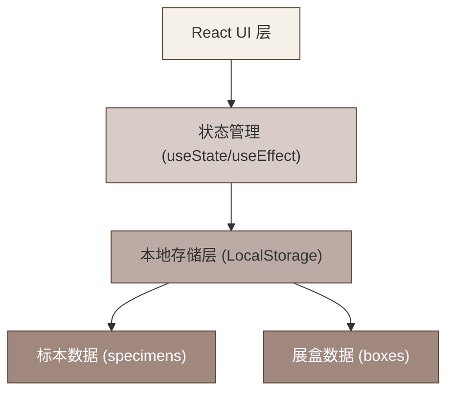
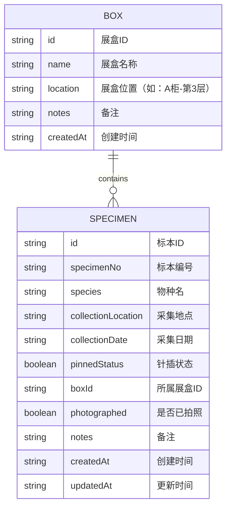

## 1. 架构设计

单机版应用，纯前端架构，数据存储在浏览器 LocalStorage 中，无需后端服务。



## 2. 技术描述

- **前端框架**: React@18 + TypeScript
- **构建工具**: Vite@5
- **样式方案**: TailwindCSS@3
- **图标库**: Lucide React（简约线性图标）
- **数据持久化**: 浏览器 LocalStorage（封装自定义 Hook）
- **后端**: 无（纯前端单机应用）
- **数据库**: 无（使用 LocalStorage 存储 JSON 数据）

## 3. 目录结构

```
src/
├── types/
│   └── index.ts          # 类型定义（Specimen, Box 等）
├── hooks/
│   ├── useLocalStorage.ts # LocalStorage 封装 Hook
│   └── useSpecimens.ts    # 标本数据管理 Hook
├── components/
│   ├── Header.tsx         # 顶部导航
│   ├── StatsCard.tsx      # 统计卡片
│   ├── FilterBar.tsx      # 筛选区域
│   ├── SpecimenCard.tsx   # 标本卡片
│   ├── BoxGroup.tsx       # 展盒分组
│   ├── SpecimenModal.tsx  # 标本添加/编辑弹窗
│   └── BoxModal.tsx       # 展盒管理弹窗
├── data/
│   └── mockData.ts        # 初始模拟数据
├── utils/
│   └── helpers.ts         # 工具函数
├── App.tsx                # 主应用组件
├── main.tsx               # 入口文件
└── index.css              # 全局样式（含 Tailwind 配置）
```

## 4. 路由定义

单页面应用，使用状态切换视图，无需路由。

| 视图 | 触发方式 | 说明 |
|------|---------|------|
| 首页 | 默认 | 按展盒分组展示标本列表 |
| 标本添加弹窗 | 点击"添加标本"按钮 | 新增标本表单 |
| 标本编辑弹窗 | 点击标本卡片 | 编辑现有标本信息 |
| 展盒管理弹窗 | 点击"展盒管理"按钮 | 管理展盒列表 |

## 5. 数据模型

### 5.1 数据模型定义



### 5.2 TypeScript 类型定义

```typescript
interface Box {
  id: string;
  name: string;
  location: string;
  notes: string;
  createdAt: string;
}

interface Specimen {
  id: string;
  specimenNo: string;
  species: string;
  collectionLocation: string;
  collectionDate: string;
  pinnedStatus: boolean;
  boxId: string;
  photographed: boolean;
  notes: string;
  createdAt: string;
  updatedAt: string;
}
```

### 5.3 LocalStorage 键定义

- `insect_boxes`: 展盒数据数组
- `insect_specimens`: 标本数据数组

### 5.4 初始数据

应用首次加载时，如果 LocalStorage 中无数据，将自动注入演示数据，包含 2-3 个展盒和 8-12 个标本示例。

## 6. 核心功能实现要点

1. **数据加载与保存**：使用自定义 `useLocalStorage` Hook，自动处理 JSON 序列化/反序列化
2. **按展盒分组**：在 `App.tsx` 中对标本数据按 `boxId` 分组，空展盒也显示
3. **筛选逻辑**：
   - 搜索：按 `specimenNo` 或 `species` 模糊匹配
   - 未拍照筛选：过滤 `photographed === false` 的标本
   - 展盒筛选：按 `boxId` 过滤
4. **表单验证**：标本编号和物种名为必填项
5. **ID 生成**：使用 `Date.now()` 加随机数确保唯一性
